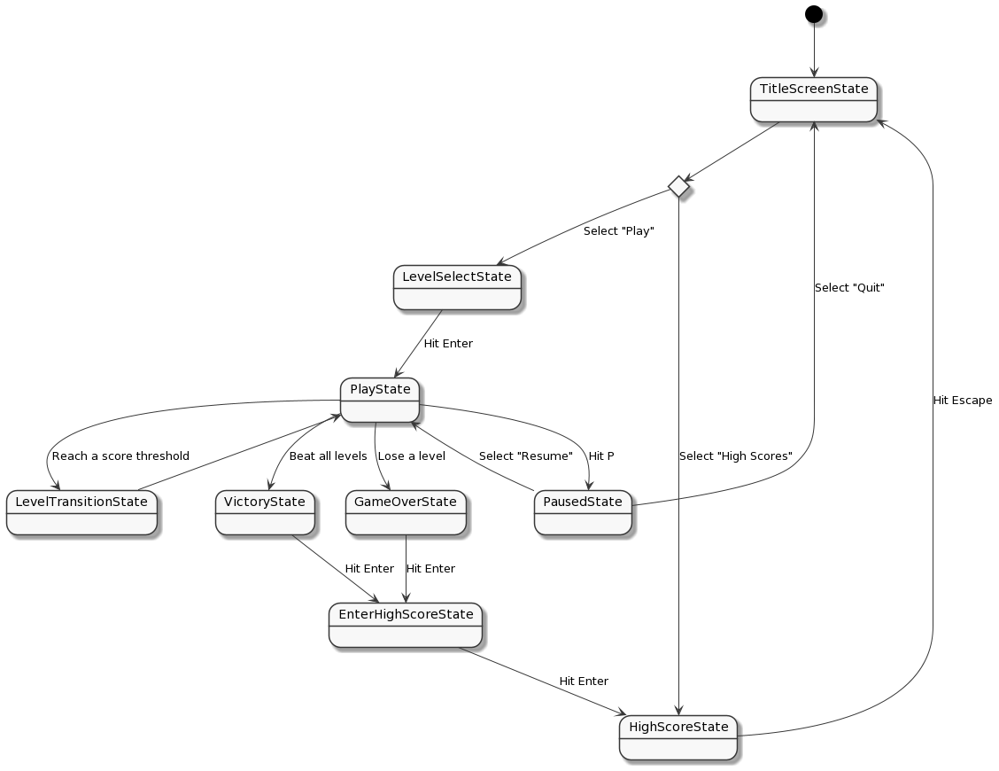
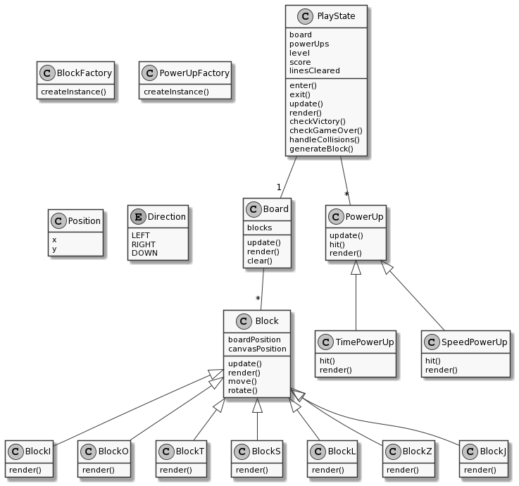
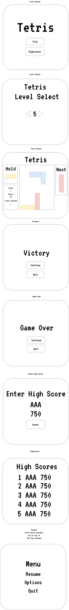

## Game Programming F21 Project - Tetris

### Table of Contents

<!--ts-->

- [Description](#️-description)
- [Gameplay](#️-gameplay)
- [Requirements](#-requirements)
  - [State Diagram](#-state-diagram)
  - [Class Diagram](#️-class-diagram)
  - [Wireframes](#-wireframes)
  - [Assets](#-assets)
    - [Images](#️-images)
    - [Fonts](#️-fonts)
    - [Sounds](#-sounds)
- [References](#-references)

<!--te-->

### ✒️ Description

In this classic retro arcade game, players aim to fit varying block shapes
(tetrominoes) into a fixed sized board with the purpose of eliminating rows
and increasing their score. Placing a block in a full column implies game
over and a certain score met implies a level win. The player wins the game by
successfully completing all levels.

### 🕹️ Gameplay

Players begin by selecting the current level they wish to start at, the higher
the level the player selects, the higher the speed in which tetrominoes fall and
the score threshold for successful completion of that level.

Once a level is selected, players are met with an empty board, score counter,
line counter, a `next` section and a `hold` section. The `next` section stores
upcoming tetrominoes and the `hold` section allows for the swapping of the
current tetromino with the current one or next one in the queue (if none on
hold).

During gameplay, players can move the current tetromino left, right and down
with the keys `a` and `d` and `s` respectively. Moreover, players can rotate
the tetromino 90 degrees with the `w` key.

When a player meets the score threshold for the current level, they transition
to the next level. If the player places a tetromino in a full column, the game
ends. Lastly, if the player meets the score threshold on the final level, they
win the game.

The player can optionally hit `m` to mute the game sound and `p` to pause the
game to bring up a menu.

### 📃 Requirements

1. The user shall be greeted with a title screen.

2. The user shall choose the level at which to start from.

3. The user should be able to place tetrominoes in the grid.

4. The user should be able to move a tetromino left, right and down using `w`,
   `a` and `s` respectively.

5. The user should be able to rotate a tetromino using `w`.

6. The user should be able to see a 'ghost tile', the position of the current
   tile if it were to reach the bottom.

7. The user should be able to press `spacebar` to move a tetromino to the
   bottom.

8. A sound effect should play on a tetromino rotation.

9. The user should be able to mute the music by pressing `m`.

10. The user should be able to pause the game by pressing `p`. This brings up a
    game menu: (Resume, How to play, Quit)

11. The player should be able to see (3) upcoming tetrominoes.

12. The user should be able to see their score, current level and number of
    lines cleared.

13. The player should be able to place a tetromino 'on hold', swapping the
    current tetromino with the one on hold, or if there aren't any on hold, the
    next one in the queue.

14. Grid rows should clear if they are full.

15. An animation should play once a row is cleared.

16. The users score should increase with each placement and row clearance.

17. The user should move to the next level once a score threshold is met.

18. The speed and score threshold should increase as the player progresses
    through the levels.

19. Confetti should play after each level win.

#### 🤖 State Diagram

#### 🗺️ Class Diagram

#### 🧵 Wireframes

The Wireframes below contain a rough outline for how the Tetris game user
interface will look. The Wireframes do not consist of game sprites that will be
used from external sources, instead they use generic shapes to represent game
objects.

 

  

 

#### 🎨 Assets

I used [app.diagrams.net](https://app.diagrams.net/) to create the Wireframes
and [PlantUML](https://plantuml.com/) in order to create the state diagram
and the class diagram.

##### 🖼️ Images

- All game sprites will be downloaded from either [itch](https://itch.io/)
  or [open game art](https://opengameart.org/).

##### ✏️ Fonts

For fonts, either the Joystix font or the VT323 font by Google, persisted
throughout the application, will suffice in order to maintain a retro style
theme.

- [Joystix](https://www.dafont.com/joystix.font)
- [VT323](https://fonts.google.com/specimen/VT323)

##### 🔊 Sounds

For sounds, there will be the tetris theme song that plays during gameplay,
sounds effects for rotation, movement, collision, and row remove (subject to
change).

- [Tetris Theme Song](https://nhacchuong68.com/tetris-theme-song/)
- [Rotation and movement sound](https://freesound.org/people/errysn/sounds/439523/)
- [Collision sound](https://freesound.org/people/Raclure/sounds/483602/)
- [Row removal sound](https://freesound.org/people/Swedger/sounds/268694/)

### 📚 References

- [Tetris Guideline](https://tetris.fandom.com/wiki/Tetris_Guideline)
